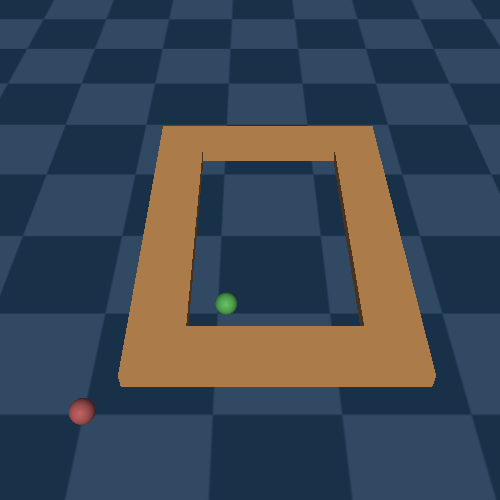
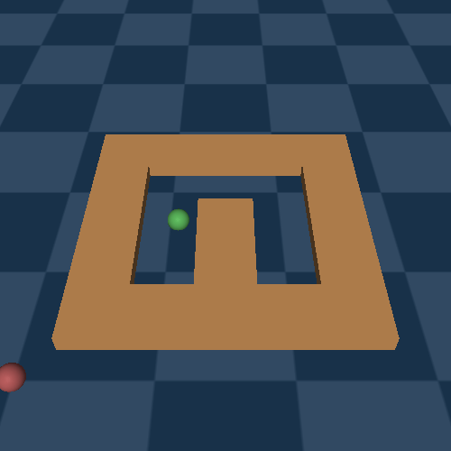

# Offline Policy Comparison with Confidence (opcc)

It's a benchmark comprising **"Policy Comparison Queries"(pcq)** to evaluate uncertainty estimation in offline
reinforcement learning.


[](https://github.com/opcciclr/opcc/actions/workflows/python-package.yml)


## Installation

**1. Setup Mujoco**
- Setup **[mujoco 200](https://www.roboti.us/index.html)** [free license can be downloaded from [here](https://www.roboti.us/license.html)]
- Add following to `.bashrc/.zshrc` and source it.
  ```bash
  export MUJOCO_PY_MUJOCO_PATH=$HOME/.mujoco/mujoco200_linux/
  export LD_LIBRARY_PATH=$LD_LIBRARY_PATH:$HOME/.mujoco/mujoco200_linux/bin
  ```
  <br>*(You can also refer **[here](https://github.com/opcciclr/opcc/blob/main/.github/workflows/python-package.yml#L27)** for step-by-step instructions on mujoco installation)*

**2. Setup [Python 3.7+](https://www.python.org/downloads/)** and optionally(recommended) create a  `virtualenv` [(refer here)](https://docs.python.org/3/tutorial/venv.html)

**3. Setup Git config**
  ```bash
  echo -e '[url "https://github.com/"]\n  insteadOf = "git://github.com/"' >> ~/.gitconfig
  ```
**4. Python package and dependencies could be installed using:**

  ```bash
  python3 -m pip install --upgrade pip setuptools wheel
  pip install git+https://github.com/opcciclr/opcc@main#egg=opcc
  ```
  
  Or
  
  ```bash
  git clone https://github.com/opcciclr/opcc.git
  cd opcc
  python3 -m pip install --upgrade pip setuptools wheel
  pip install -e .
  ```

**4. Install Pytorch [\[>= 1.8.0\]](https://pytorch.org/)**

## Usage

### Queries:

```python
import opcc
import numpy as np
from sklearn import metrics

env_name = 'HalfCheetah-v2'
dataset_name = 'random'

# ########################################################
# Policy Comparison Queries (PCQ) (Section : 3.1 in paper)
# ########################################################
# Queries are dictionaries with policies as keys and
# corresponding queries as values.
queries = opcc.get_queries(env_name)


def random_predictor(obs_a, obs_b, actions_a, actions_b,
                     policy_a, policy_b, horizon):
    answer = np.random.randint(low=0, high=2, size=len(obs_a)).tolist()
    confidence = np.random.rand(len(obs_a)).tolist()
    return answer, confidence


targets = []
predictions = []
confidences = []
# Batch iteration through Queries :
for (policy_a_id, policy_b_id), query_batch in queries.items():

    # retrieve policies
    policy_a, policy_b = None, None
    if policy_a_id is not None:
        policy_a, _ = opcc.get_policy(*policy_a_id)
    if policy_b_id is not None:
        policy_b, _ = opcc.get_policy(*policy_b_id)

    # query-a
    obs_a = query_batch['obs_a']
    actions_a = query_batch['action_a']

    # query-b
    obs_b = query_batch['obs_b']
    actions_b = query_batch['action_b']

    # horizon for policy evaluation
    policy_horizon = query_batch['policy_horizon']

    # ground truth binary vector:
    # (Q(obs_a, action_a, policy_a, horizon)
    # <  Q(obs_b, action_b, policy_b, horizon))
    target = query_batch['target'].tolist()
    targets += target

    # Let's make predictions for the given queries.
    # One can use any mechanism to predict the corresponding
    # answer to queries, and we simply use a random predictor
    # over here for demonstration purposes
    p, c = random_predictor(obs_a, obs_b, actions_a, actions_b,
                            policy_a, policy_b, policy_horizon)
    predictions += p
    confidences += c
```

### Evaluation Metrics:

```python
# #########################################
# (Section 3.3 in paper)
# #########################################
loss = np.logical_xor(predictions, targets)  # we use 0-1 loss for demo

# List of tuples (coverage, selective_risks, tau)
coverage_sr_tau = []
tau_interval = 0.01
for tau in np.arange(0, 1 + 2 * tau_interval, tau_interval):
    non_abstain_filter = confidences >= tau
    if any(non_abstain_filter):
        selective_risk = np.sum(loss[non_abstain_filter])
        selective_risk /= np.sum(non_abstain_filter)
        coverage = np.mean(non_abstain_filter)
        coverage_sr_tau.append((coverage, selective_risk, tau))
    else:
        # 0 risk for 0 coverage
        coverage_sr_tau.append((0, 0, tau))

coverages, selective_risks, taus = list(zip(*sorted(coverage_sr_tau)))
assert selective_risks[0] == 0 and coverages[0] == 0, "no coverage not found"
assert coverages[-1] == 1, 'complete coverage not found'

# AURCC ( Area Under Risk-Coverage Curve): Ideally, we would like it to be 0
aurcc = metrics.auc(x=coverages, y=selective_risks)

# Reverse-pair-proportion
rpp = np.logical_and(np.expand_dims(loss, 1)
                     < np.expand_dims(loss, 1).transpose(),
                     np.expand_dims(confidences, 1)
                     < np.expand_dims(confidences, 1).transpose()).mean()

# Coverage Resolution (cr_k) : Ideally, we would like it to be 1
k = 10
bins = [_ for _ in np.arange(0, 1, 1 / k)]
cr_k = np.unique(np.digitize(coverages, bins)).size / len(bins)

print("aurcc: {}, rpp: {}, cr_{}:{}".format(aurcc, rpp, k, cr_k))
```

### Dataset:

```python

# ###########################################
# Datasets: (Section 4 in paper - step (1) )
# ###########################################

import opcc

env_name = 'HalfCheetah-v2'

# list all dataset names corresponding to an env
dataset_names = opcc.get_dataset_names(env_name)

dataset_name = 'random'
# This is a very-slim wrapper over D4RL datasets.
dataset = opcc.get_qlearning_dataset(env_name, dataset_name)

```

### Policy Usage:

```python
import opcc, gym, torch

env_name = "HalfCheetah-v2"
model, model_info = opcc.get_policy(env_name, id=1)

done = False
env = gym.make(env_name)

obs = env.reset()
while not done:
    action = model.actor(torch.tensor(obs).unsqueeze(0))
    action = action.data.cpu().numpy()[0].astype('float32')
    obs, reward, done, step_info = env.step(action)
    env.render()
```

## Benchmark Information

- We borrow dataset's from [**D4RL**](https://arxiv.org/abs/2004.07219)
- Baselines can be found here [**HERE**](https://github.com/opcciclr/opcc-baselines)

### [Maze2d](https://github.com/rail-berkeley/d4rl/wiki/Tasks#maze2d)

#### Datasets:

|                                              Environment Name                                              |      Datasets       |    Query-Count    |
|:----------------------------------------------------------------------------------------------------------:|:-------------------:|:-----------------:|
| `d4rl:maze2d-open-dense-v0` / <br>`d4rl:maze2d-medium-dense-v1` / <br> `d4rl:maze2d-umaze-dense-v1` / <br> `d4rl:maze2d-large-dense-v1`| `1m` |      `1500`       |

#### Policies:

1. `d4rl:maze2d-open-dense-v0`

|`Id`|`1`|`2`|`3`|`4`|`5` | 
|:------: | :------: | :------: | :------: | :------: | :------: | 
|__Performance__| `122.78±11.35`| 53.74±6.14| 38.92±3.72| 28.97±9.72| 25.14±5.99 | 
|__Render__| | | | |  | 

2. `d4rl:maze2d-umaze-dense-v1 `

|Id|`1`|`2`|`3`|`4`|`5` | 
|:------: | :------: | :------: | :------: | :------: | :------: | 
|__Performance__| 189.58±97.72| 59.94±59.2| 84.39±26.57| 33.06±2.05| 20.09±2.75 | 
|__Render__| | | | |  | 

3. `d4rl:maze2d-medium-dense-v1`

|Id|`1`|`2`|`3`|`4`|`5` | 
|:------: | :------: | :------: | :------: | :------: | :------: | 
|__Performance__| 344.65±251.2| 41.45±28.39| 42.64±57.55| 41.54±53.72| 17.89±35.09 | 
|__Render__| | | | |  | 

4. `d4rl:maze2d-large-dense-v1 `

|Id|`1`|`2`|`3`|`4`|`5` | 
|:------: | :------: | :------: | :------: | :------: | :------: | 
|__Performance__| 434.62±304.81| 38.21±37.41| 31.71±95.52| 3.96±7.64| 1.58±3.03 | 
|__Render__| | | | |  | 

### [Mujoco(gym)](https://gym.openai.com/envs/#mujoco)

#### Datasets:

| Environment Name |                        Datasets                        |    Query-Count    |
|:----------------:|:------------------------------------------------------:|:-----------------:|
| `HalfCheetah-v2` / <br> `Hopper-v2` / <br> `Walker2d-v2`| `random, expert, medium, medium-replay, medium-expert` |      `1500`       |

#### Policies:

`Hopper-v2`

|`ID`|`1`|`2`|`3`|`4`|`5` | 
|:------: | :------: | :------: | :------: | :------: | :------: | 
|__Performance__| 3299.66±276.09 <br> | 2045.22±1.73 <br> | 1508.25±2.32 <br> | 1238.79±16.99 <br> | 1007.46±3.92 <br>  | 
|__Render__| | | | |  | 

|`ID`|`6`|`7`|`8`|`9`|`10` | 
|:------: | :------: | :------: | :------: | :------: | :------: | 
|__Performance__| 860.73±45.74 <br> | 851.59±4.03 <br> | 582.85±4.28 <br> | 194.61±1.91 <br> | 82.45±5.12 <br>  | 
|__Render__| | | | |  |

`Walker2d-v2`

|`ID`|`1`|`2`|`3`|`4`|`5` | 
|:------: | :------: | :------: | :------: | :------: | :------: | 
|__Performance__| 1927.57±12.63 <br> | 1890.5±364.1 <br> | 1840.41±267.98 <br> | 1474.85±11.06 <br> | 670.85±26.87 <br>  | 
|__Render__| | | | |  | 

|`ID`|`6`|`7`|`8`|`9`|`10` | 
|:------: | :------: | :------: | :------: | :------: | :------: | 
|__Performance__| 470.44±168.56 <br> | 70.3±18.13 <br> | -235.86±172.73 <br> | -1330.97±160.05 <br> | -1770.03±730.95 <br>  | 
|__Render__| | | | |  | 

`HalfCheetah-v2` 

|`ID`|`1`|`2`|`3`|`4`|`5` | 
|:------: | :------: | :------: | :------: | :------: | :------: | 
|__Performance__| 6444.43±126.62 <br> | 3117.89±11.52 <br> | 1552.93±50.73 <br> | 458.44±4.39 <br> | -157.07±5.14 <br>  | 
|__Render__| | | | |  | 

|`ID`|`6`|`7`|`8`|`9`|`10` | 
|:------: | :------: | :------: | :------: | :------: | :------: | 
|__Performance__| -947.54±2.43 <br> | -1398.44±4.59 <br> | -2318.62±3.89 <br> | -4296.63±63.46 <br> | -8757.07±150.54 <br>  | 
|__Render__| | | | |  | 

## Testing Package:

- Install : `pip install -e ".[test]"`
- Run: `pytest -v`
- Testing is computationally expensive as we validate ground truth value estimates and corresponding labels. These can
  be disabled by setting following flags:
  ```bash
  export SKIP_QUERY_TARGET_TESTS=1 # disable target estimation and label validation  
  export SKIP_Q_LEARNING_DATASET_TEST=1  # disable test for checking dataset existence
  export SKIP_SEQUENCE_DATASET_TEST=1 # disables test for checking sequence dataset
  ```

## Development:

- Install : `pip install -e ".[all]"`
- Generate-Queries:
  ```bash
  % following commands were used to generate queries
  python scripts/generate_queries.py --env-name HalfCheetah-v2 --horizons 10 20 30 40 50 --policy-ids 1 2 3 4 --noise 0.1 --eval-runs 10 --ignore-delta 10 --max-trans-count 2000 --ignore-stuck-count 1000 --save-prob 0.6 --per-policy-comb-query 250 --use-wandb
  python scripts/generate_queries.py --env-name Hopper-v2 --horizons 10 20 30 40 50 --policy-ids 1 2 3 4 --noise 0.1 --eval-runs 10 --ignore-delta 10 --max-trans-count 2000 --ignore-stuck-count 1000 --save-prob 0.6 --per-policy-comb-query 250 --use-wandb
  python scripts/generate_queries.py --env-name Walker2d-v2 --horizons 10 20 30 40 50 --policy-ids 1 2 3 4 --noise 0.1 --eval-runs 10 --ignore-delta 10 --max-trans-count 2000 --ignore-stuck-count 1000 --save-prob 0.6 --per-policy-comb-query 250 --use-wandb
  python scripts/generate_queries.py --env-name d4rl:maze2d-large-v1 --horizons 10 20 30 40 50 --policy-ids 1 2 3 4 --noise 0.2 --eval-runs 10 --ignore-delta 10 --max-trans-count 2000 --ignore-stuck-count 1000 --save-prob 0.6 --per-policy-comb-query 250 --use-wandb
  python scripts/generate_queries.py --env-name d4rl:maze2d-umaze-v1 --horizons 10 20 30 40 50 --policy-ids 1 2 3 4 --noise 0.2 --eval-runs 10 --ignore-delta 10 --max-trans-count 2000 --ignore-stuck-count 1000 --save-prob 0.6 --per-policy-comb-query 250 --use-wandb
  python scripts/generate_queries.py --env-name d4rl:maze2d-medium-v1 --horizons 10 20 30 40 50 --policy-ids 1 2 3 4 --noise 0.2 --eval-runs 10 --ignore-delta 10 --max-trans-count 2000 --ignore-stuck-count 1000 --save-prob 0.6 --per-policy-comb-query 250 --use-wandb
  python scripts/generate_queries.py --env-name d4rl:maze2d-open-v0 --horizons 10 20 30 40 50 --policy-ids 1 2 3 4 --noise 0.5 --eval-runs 10 --ignore-delta 10 --max-trans-count 2000 --ignore-stuck-count 1000 --save-prob 0.6 --per-policy-comb-query 250 --use-wandb
  ```
- Generate policy performance stats for readme:
  ```bash
  python scripts/generate_policy_stats.py --all-envs
  ```

